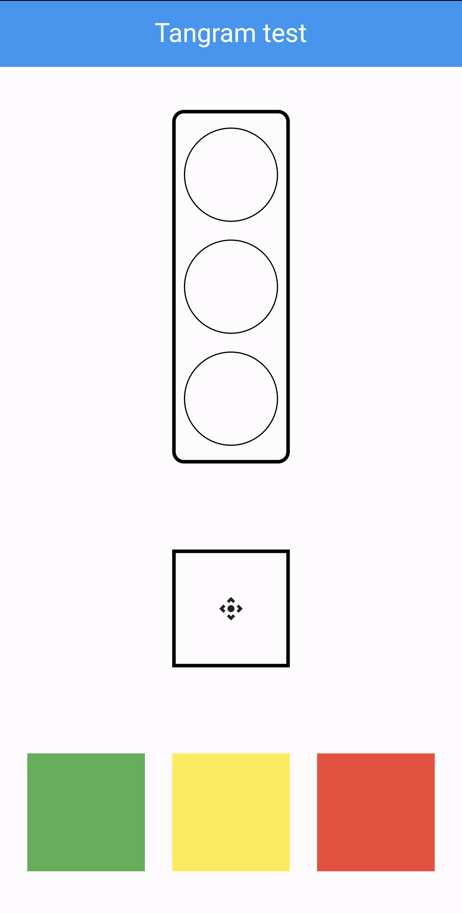

# TangramTest

 Test task for Flutter developer

# Flutter test Traffic light

There is a traffic light in the top of the screen, 
below is the controller. At the bottom of the screen there are 3 colors: 
green, yellow, red. Each of the colors can be dragged to the Controller, 
and then the color on the Traffic Light will change. 
And the SnackBar will display the message Stop/Wait/Go accordingly. 
But if the dragged color matches the current traffic signal, 
the message “Duplicate signal” should be displayed.

Requirements:
- do not use third party packages.
- do not use global variables.
- traffic light, controller, color panel - 3 separate widgets.
- the constructors of these 3 widgets should not have parameters.

UI example:

Work example:

